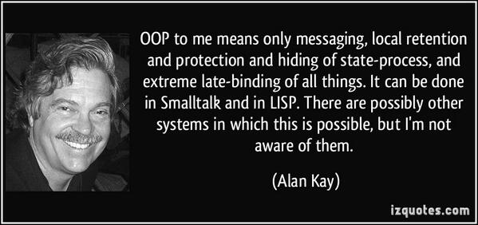

# QuickStart
* **[Installation Instructions](Installation-Instructions)**
* **[Running A Script](Running-A-Script)**
Please see the [Essence# blog](http://essencesharp.wordpress.com/). All release announcements, and introductory explanations of new features, are published on the [blog](http://essencesharp.wordpress.com/). Release announcements, and links to new articles published on the [blog](http://essencesharp.wordpress.com/), are also posted on the [Essence# page on Google+](https://plus.google.com/u/0/b/105690251530428140190/105690251530428140190/posts).

# The Basics

* Essence# [Syntax](Syntax)
* The [Object State Architecture](Object-State-Architecture) Of Essence# Objects
* Essence# [Namespaces](Namespaces)
* Essence# [Classes](Classes)
* Essence# [Traits](Traits)
* Essence# [Class Libraries](Class-Libraries)
* The Essence# [Standard Library](Standard-Library)
* The Essence# [Library Loader](Library-Loader)
* Essence# [Configuration Profiles](Configuration-Profiles)

# .Net Integration 
* [Using CLR Types](Using-CLR-Types) (Classes, structs, fields, properties & methods written in C#, F# or Visual Basic) in Essence#
* [Passing Blocks As Arguments To Parameters Requiring A CLR Delegate](Passing-Blocks-As-Arguments-To-Parameters-Requiring-A-CLR-Delegate) from Essence#
* Raising And/Or Handling [CLR Events](CLR-Events) from Essence#
* [Invoking CLR methods that have “out” or “ref” parameters](Invoking-CLR-methods-that-have-“out”-or-“ref”-parameters) from Essence#
* Using [CLR Generic Types](CLR-Generic-Types) in Essence#

# Developing Code
* Essence# [Integration Issues](Integration-Issues): Handling multiple releases of Essence# and/or integrating with multiple, independent vendors and/or projects
* The Essence# [Compiler](Compiler)
* Auxilliary [Tools](Tools) for coding and developing in Essence#

# Down The Rabbit Hole
_This section is under construction. It will gradually be populated with documentation of the architecture, design and implementation of the Essence# lexical analyzer, parser, compiler, run time system and dynamic binding subsystem._

* Essence# [Object Spaces](Object-Spaces)

_
The essence of OOP: It's all messages, all the time._

